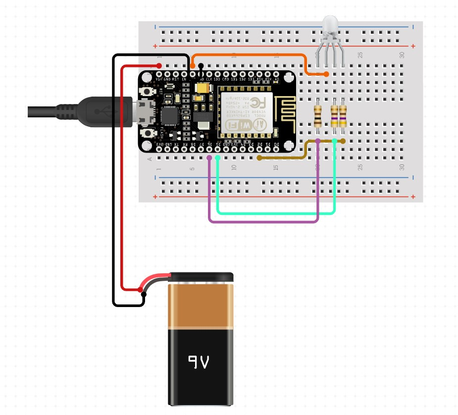

# Diwali-IoT

Diwali-iot is a Flask based Internet of Things (IoT) static application that changes the color of the lamp wick based on the color given by the user in the application.


[Diwali IoT](https://diwaliiot.herokuapp.com/)

[API Endpoint](https://diwaliiot.herokuapp.com/api)

---

The following technologies are ued to accompalish this project

## Software

1. Frontend

   - HTML
   - CSS

2. Backend

   - Flask (Python)

3. Storage

   - File System
   - JSON

4. Deployment
   - Heroku

## Hardware

| Slno | Components                        | Specifications               | Quantity            |
| ---- | --------------------------------- | ---------------------------- | ------------------- |
| 1    | Wifi Module Based Microcontroller | Node MCU                     | 1                   |
| 2    | RGB Led                           | 5V (Common Anode )           | 1                   |
| 3    | Power Source                      | Battery (9V)                 | 1                   |
| 4    | Resistors                         | 1.2 $K\Omega$                | 3                   |
| 5    | Jumper Wires                      | Male to Male, Male to Female | As many as required |

## Circuit



## Pin Connection

| Pin Name         | Pin Number   |
| ---------------- | ------------ |
| Red Pin          | D6 (GPIO 12) |
| Green Pin        | D5 (GPIO 14) |
| Blue Pin         | D2 (GPIO 4)  |
| Comman Anode Pin | 3V3          |

## Set up

```cmd
git clone https://github.com/SHESHANKSK/diwaliiot.git
cd diwaliiot

```

```cmd
pip install mkvirtualenv
```

```cmd
mkvirtualenv <name of virtual environment>
workon <name of virtual environment>
```

```cmd
pip install -r requirements.txt
```

```cmd
flask run
OR
python app.py
```

## Wifi and Endpoint Configurations

main.ino file

Change the name of your wifi and password

```cpp
const char *wifiName = "wifiname";
const char *wifiPass = "password";
```

Deploy your flask app and get get the api link and change

```cpp
const char *host = "write the endpoint where your api is exposed";
```

## Deployment

**Platform Used** : Heroku

```cmd
heroku login
heroku create <name of your app>
git push heroku master
```

## Reference

Front-end Design : [Coding Artist Web](https://codingartistweb.com/2021/11/diya-css-animation-diwali-special/)

Deployment: [Push Flask Apps To Heroku For Webhosting - Python and Flask #11](https://youtu.be/Li0Abz-KT78)
